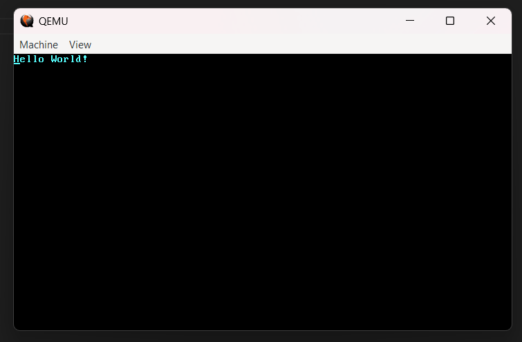

# ParvaOS

 

> NOTE: For now the kernel is only able to print an 'Hello World!' string

**ParvaOS** is an operating system written in Rust by Francesco Giannice.

## Features

- x86 CPU support (64 bit)
- VGA Text mode

## TODO:
* Manage CPU Exceptions
* Hardware interrupts
* Serial output
* Paging
* Heap allocation
* Add a basic file system
* Add some games
* Implement a basic GUI

## How to compile ParvaOS' code?

If you want to compile the whole project on your local machine, follow these instructions:

1. **Install Rust:**

   Rust is required to compile ParvaOS. You can download it from [rust-lang.org](https://www.rust-lang.org/).

2. **Clone the repo:**

    ```
    git clone https://github.com/gianndev/parvaos.git
    cd parvaos
    ```

3. **Build the ParvaOS kernel:**

    ```
    make build
    ```

4. **Run the ParvaOS kernel:**

    ```
    make run
    ```

## Acknowledgments:
* A special thanks to Phil-Opp's [blog](https://os.phil-opp.com/) 

## License

This project is licensed under the terms of the GNU General Public License v3.0 only (GPL-3.0-only).  
See the [LICENSE](./LICENSE) file for details.